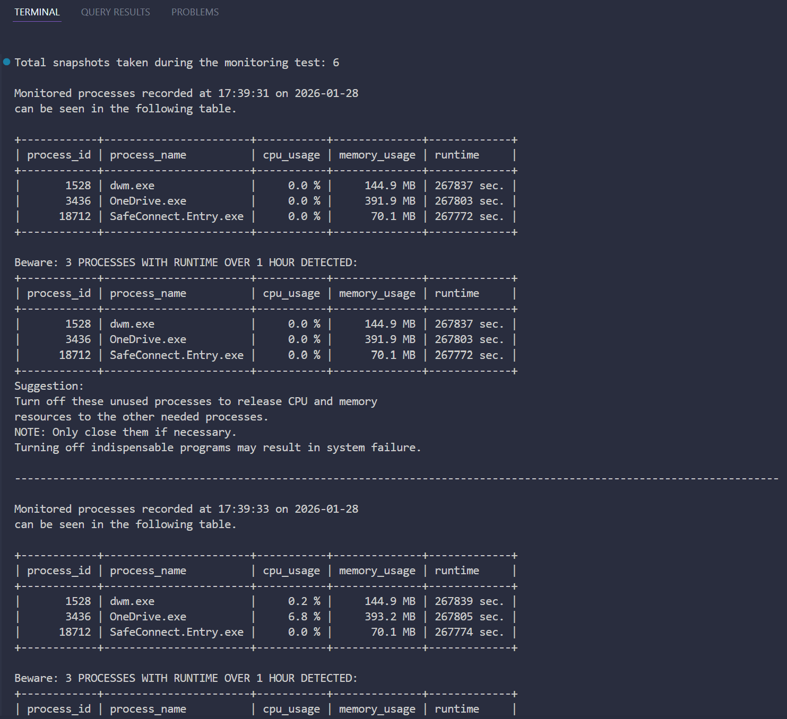

# System Monitoring and Test Harness (Python)

## Overview

This project was initially built as an operating-system monitoring tool written in Python.
After that, I wanted to see what a test on OS resources looks like.

Hence, I extended it into a small test harness to observe how monitoring behaves when the system is under load.

The goal is not to stress hardware to its limits. Instead, it is designed as a controlled, repeatable test similar to validations of long-running system software.

## Why this project?

I wanted to see whether I could design a small test that runs unattended.

Therefore, I added a test harness that runs monitoring and workload in parallel and evaluates the OS usage afterwards.

## Architecture

To keep the code testable and easier to reason about, I separated the system into three independent components:

- `workload.py`: generates a controlled CPU workload for a given, fixed duration
- `monitor.py`: collects snapshots of process-level CPU, memory, and runtime data
- `evaluator.py`: checks snapshots to see if any processes recorded in tests exceed predefined thresholds

A small test runner script starts the workload and monitoring in parallel, then evaluates the collected data after the test finishes.

### How to run this program

All the packages needed are listed in `requirements.txt`.

The test harness uses `system_monitoring_test_runner.py` as the main entry point.

That is, run the following commands in your terminal screen:
```
pip install -r requirements.txt
python system_monitoring_test_runner.py
```
Note: `monitor.py` can also run independently to observe OS processes for a long time period.

To run it, simply run the following commands in your terminal screen:
```
python ./src/monitor.py
```

The `monitor.py` program can be terminated by pressing `Ctrl + C`.

## Why this design

I intentionally avoided putting everything into a single script:

- Keeping workload generation separate prevents test logic from affecting the monitoring behavior.
- Time-bounded execution makes tests predictable and avoids runaway threads.
- Monitoring runs concurrently with workload to reflect real-world observation, not post-run inspection.
- Evaluation is done after data collection so that detection logic has no side effects on monitoring.

This is a simple design that nevertheless makes the OS monitoring behavior easier to test and reason about.

## What is being tested

- Whether CPU usage reported by the OS changes predictably under controlled load
- Whether memory and runtime thresholds can be detected consistently
- Whether monitoring continues to function correctly while the system is busy

This project does not aim to model real datacenter traffic or hardware-level performance.

## Relevance to Datacenter System Software

While this project is small-scale, it touches on problems that are common in system software testing, such as:

- long-running processes
- OS-level telemetry
- automated detection of abnormal behavior
- separating data collection from evaluation logic

The same patterns apply to larger monitoring and validation systems.

## Technologies

- Python
- `psutil` for OS-level telemetry
- **Thread-based** orchestration for concurrent workload and monitoring

## Sample test screenshot

One of the test demonstration can be seen below:



It only represent 1st of all the 6 snapshots recorded,
with the filtered processes, if found, having their

- **CPU usage (in percentage)**
- **memory usage (in *MB*)**
- **runtime since start-up (in *seconds*)**

listed in the sheet.

The program will then show users which processes in the filtered ones
have either of three properties above exceeding the respective thresholds,
asking them to stop or restart them if necessary.

## Notes

- This project was developed and tested on a personal machine (in my case, Windows 11 64-bit), not a production server.
- Some values, such as thresholds and sampling intervals, were chosen for demonstration purposes, but they can also be adjusted for custom tests.
